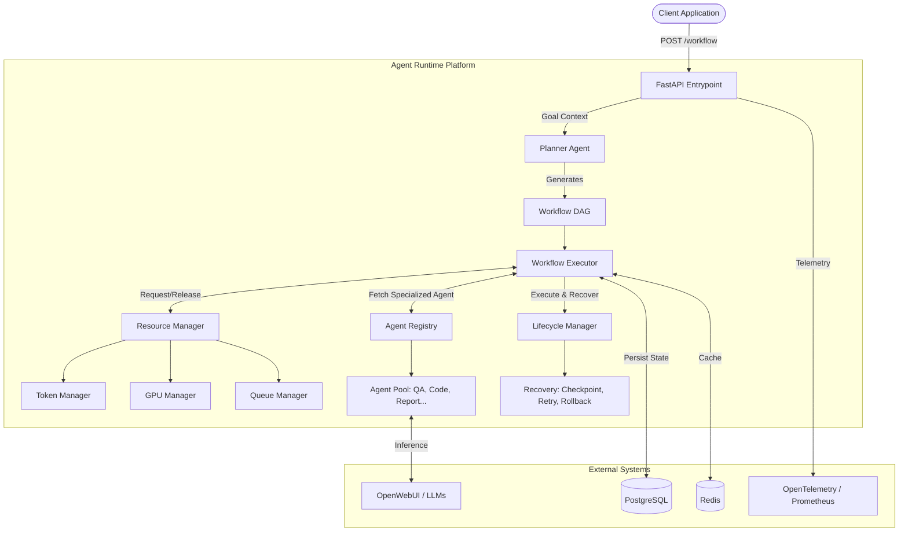
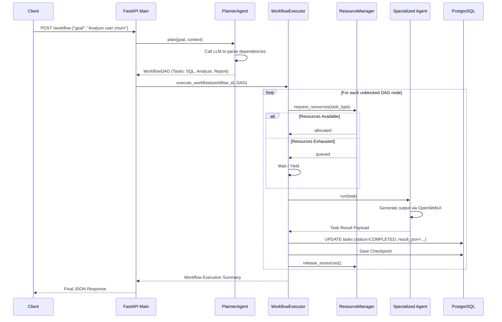

# AgentFabric

Enterprise-grade orchestration framework for autonomous, resilient multi-agent workflow execution.

## Executive Summary

AgentFabric is a distributed, stateful execution engine designed to orchestrate complex operations via multi-agent Large Language Model (LLM) workflows. It abstracts the complexity of inter-agent communication, workflow persistence, distributed resource scheduling (GPU and token limits), and fault tolerance into a cohesive runtime environment.

Designed for mission-critical operations, the platform evaluates high-level objectives, compiles them into a Directed Acyclic Graph (DAG) of interdependent tasks, and dynamically routes these tasks to specialized agents (e.g., planners, coders, researchers). The system maintains strict hardware constraints and ensures complete observability via OpenTelemetry.

## Business Problem

Traditional LLM integration patterns are characterized by synchronous, stateless, single-turn prompts. When applied to complex enterprise processes, these patterns suffer from:

*   **Context Loss:** Inability to persist complex multi-step state safely across boundaries.
*   **Monolithic Failure:** A failure in step 8 of a 10-step process forces a complete restart, wasting expensive compute resources and API quotas.
*   **Resource Starvation:** Unbounded parallel execution can overwhelm GPU VRAM limits or breach organizational LLM token budgets.
*   **Task Mismatch:** Routing all tasks to a monolithic model is cost-ineffective and computationally suboptimal.

AgentFabric was built to resolve these structural limitations by introducing a robust scheduler, DAG-based orchestration, state checkpointing, and dynamic model routing.

## Solution Overview

AgentFabric solves these challenges by treating LLM interactions as discrete compute tasks within a larger, fault-tolerant execution graph. When a goal is submitted, a `PlannerAgent` parses the requirements and builds a valid DAG. The `WorkflowExecutor` traverses the graph, requests physical and financial resources via the `ResourceManager`, and assigns atomic units of work to highly specialized agents through an `AgentRegistry`. 

Continuous checkpointing to PostgreSQL ensures that workflows can be resumed precisely from the point of failure, enabling resilient autonomous operations at scale.

## Key Features

*   **DAG-Based Orchestration:** Generates and executes interdependent multi-task workflows efficiently.
*   **Dynamic Agent Registry:** Extensible architecture supporting specialized agents (Research, Coding, QA, Report, Vision).
*   **Resource-Aware Scheduling:** Prevents execution unless sufficient GPU VRAM and token budgets are available via a unified `ResourceManager`.
*   **Stateful Fault Tolerance:** Implements automated checkpointing, sophisticated retry logic with exponential backoff, and state rollbacks.
*   **Multi-Backend Memory Integration:** Out-of-the-box support for PostgreSQL (relational state), Redis (caching), and Qdrant (vector embeddings).
*   **Unified Observability:** Integrates OpenTelemetry, Prometheus metrics, and Langfuse for complete trace visibility.
*   **Intelligent Model Routing:** Evaluates task requirements and routes instructions to the most optimal LLM based on task-to-model scoring matrices.

## Architecture Overview

AgentFabric relies on a modular, event-driven architecture. The outer layer exposes RESTful APIs via FastAPI. The orchestration layer relies on a DAG evaluation loop. The lower layers interface with physical infrastructure, LLM providers (via OpenWebUI), and persistent storage.



### Major Components and Responsibilities

1.  **FastAPI Application (`api/main.py`):** Acts as the ingress controller, handling HTTP connections, lifecycle management, database pool initialization, and exposing operational metrics.
2.  **Planner Agent (`agents/planner/planner.py`):** A specialized meta-agent tasked solely with digesting human intent and returning a structured JSON graph representing the necessary execution steps.
3.  **Workflow Executor (`runtime/executor/workflow_executor.py`):** The core control loop. Traverses the DAG, identifies unblocked nodes, manages execution state, and updates the database.
4.  **Resource Manager (`runtime/scheduler/resource_manager.py`):** Acts as a gatekeeper. Evaluates node requirements against current system capacity (VRAM, API tokens) and either allocates or queues requests.
5.  **Agent Registry (`agents/registry.py`):** The factory interface linking a logical task type to a concrete Python class implementation of `BaseAgent`.

## System Components

### `agents/`
*   **Purpose:** Houses the business logic for specific domain tasks.
*   **Responsibilities:** Formatting system prompts, executing inference requests, parsing responses, and evaluating output quality.
*   **Dependencies:** `BaseAgent`, `openwebui` integration, `router`.

### `api/`
*   **Purpose:** Exposes system capabilities to external consumers.
*   **Responsibilities:** Request validation, response serialization, asynchronous background task kickoffs, and dependency injection.
*   **Dependencies:** `pydantic`, `fastapi`, `runtime.executor`.

### `memory/`
*   **Purpose:** Manages long-term and short-term state.
*   **Responsibilities:** Relational mappings, connection pooling, cache retrieval.
*   **Dependencies:** `asyncpg`, `redis`, `qdrant-client`.

### `runtime/`
*   **Purpose:** The central nervous system of AgentFabric.
*   **Responsibilities:** Orchestrating task execution, enforcing constraints, and managing failure scenarios.
*   **Dependencies:** `memory.postgres.db`, `observability`.

### `observability/`
*   **Purpose:** Provides insights into platform behavior.
*   **Responsibilities:** Logging, distributed tracing across network boundaries, and metric accumulation.
*   **Dependencies:** `opentelemetry-api`, `prometheus-client`.

### `router/`
*   **Purpose:** Model selection logic.
*   **Responsibilities:** Evaluating which underlying LLM is best suited for a task type based on latency, context window, and accuracy scores.

## Request Lifecycle

The lifecycle of a typical workflow request demonstrates the framework's strict adherence to resource constraints and state management.



## Core Workflows

1.  **Workflow Planning:** Driven by `PlannerAgent`. Transforms unstructured natural language into a highly structured dependency graph adhering to exact JSON schemas, with a hardcoded fallback DAG for resilience against malformed LLM outputs.
2.  **Task Execution Loop:** Driven by `WorkflowExecutor`. A continuous asynchronous loop identifying unblocked nodes in the DAG, acquiring resource locks, dispatching agents, and committing state sequentially.
3.  **State Recovery:** Initiated when a node returns a failure state or throws an unhandled exception. The `RetryController` checks backoff configurations. If exhaustion occurs, the `RollbackController` marks the workflow as failed, preserving all previous state for manual intervention or partial data extraction.

## Technology Stack

| Category | Technology |
| :--- | :--- |
| **Web Framework** | FastAPI, Uvicorn |
| **Language** | Python 3 |
| **Data Validation** | Pydantic 2.7 |
| **Relational Database** | PostgreSQL (accessed via `asyncpg`, `sqlalchemy`) |
| **Caching & Message Broker** | Redis (`redis` library) |
| **Vector Store** | Qdrant (`qdrant-client`) |
| **Graph Logic** | NetworkX |
| **Observability** | OpenTelemetry, Prometheus Client, Langfuse |
| **LLM Gateway** | OpenWebUI integration |
| **Migrations** | Alembic |

## Repository Structure

```text
.
├── agents/
│   ├── base_agent.py          # Abstract definition of an agent
│   ├── registry.py            # Agent class mapping and instantiation
│   ├── planner/               # Specialized Planner Agent module
│   ├── coding/                # Specialized Code execution module
│   ├── qa/                    # Specialized Quality Assurance module
│   ├── report/                # Specialized Reporting module
│   ├── research/              # Specialized Research module
│   └── vision/                # Specialized Vision processing module
├── api/
│   ├── main.py                # Core REST API definitions and lifecycle hooks
│   └── static/                # Static assets for internal dashboard interfaces
├── memory/
│   ├── config_loader.py       # YAML configuration parser
│   ├── postgres/              # RDBMS connection handlers and pooling
│   ├── qdrant/                # Vector store connection handlers
│   └── redis/                 # Key-Value cache wrappers
├── observability/
│   └── metrics.py             # Prometheus metrics and OTel tracing setup
├── openwebui/                 # Client wrapper for LLM network requests
├── router/
│   └── model_router/          # Dynamic model scoring and routing logic
├── runtime/
│   ├── executor/              # Core execution loop and DAG validation
│   ├── lifecycle/             # Agent state machine transitions
│   ├── recovery/              # Checkpoint parsing, retries, and rollback
│   └── scheduler/             # GPU allocation, queues, token consumption logic
├── config.yml                 # Infrastructure and model configuration
├── requirements.txt           # Python dependency tree
└── run.py                     # Uvicorn entry script
```

## API Documentation

| Method | Route | Purpose | Request Format | Response Format |
| :--- | :--- | :--- | :--- | :--- |
| `GET` | `/health` | System readiness check | None | `{ "status": "ok", "services": {...} }` |
| `POST` | `/workflow` | Submits a new goal for orchestration | `{"goal": "str", "context": {}}` | `{"workflow_id": "uuid", "status": "...", ...}` |
| `GET` | `/workflow/{id}` | Retrieves execution trace of a workflow | Path param: `id` | `{"workflow_id": "uuid", "tasks": [...]}` |
| `GET` | `/workflows` | Lists recent workflows | None | `[{"workflow_id": "uuid", "status": "..."}]` |
| `GET` | `/agents` | Lists active agents | None | `[{"agent_id": "...", "model_name": "..."}]` |
| `GET` | `/agents/{id}` | Retrieves specific agent state | Path param: `id` | `{"agent_id": "...", "state": "..."}` |
| `POST` | `/agents/{id}/transition` | Manually transitions agent state | `{"new_state": "str"}` | `{"agent_id": "...", "state": "..."}` |
| `GET` | `/system/status` | Returns scheduler queue and VRAM metrics | None | `{"gpu": {...}, "queue_size": int, ...}` |
| `GET` | `/models` | Lists available LLMs and their scoring matrices | None | `[{"model_key": "...", "scores": {...}}]` |
| `POST` | `/test/model` | Directly invokes an LLM bypassing DAG | `{"model_name": "...", "prompt": "..."}`| `{"response": "..."}` |
| `GET` | `/metrics` | Exposes Prometheus metrics | None | Redirects to port 9090 |

## Database Design

The persistence layer relies on PostgreSQL configured for asynchronous execution via `asyncpg`. Key inferred tables include:

*   **`workflows` Table:**
    *   `workflow_id` (UUID, Primary Key)
    *   `name` (String)
    *   `status` (String Enum: RUNNING, COMPLETED, FAILED)
    *   `dag_json` (JSONB): Serialized definition of the graph
    *   `created_at` (Timestamp)
    *   `completed_at` (Timestamp)

*   **`tasks` Table:**
    *   `task_id` (UUID, Primary Key)
    *   `workflow_id` (UUID, Foreign Key)
    *   `agent_id` (UUID)
    *   `name` (String)
    *   `task_type` (String)
    *   `status` (String Enum: PENDING, RUNNING, COMPLETED, FAILED)
    *   `model_used` (String)
    *   `tokens_used` (Integer)
    *   `result_json` (JSONB): Agent output payload
    *   `started_at`, `completed_at` (Timestamps)

State transitions update the `tasks` and `workflows` table continuously using UPSERT operations to maintain highly concurrent consistency.

## Configuration

The application is configured primarily through a `config.yml` parsed by `memory.config_loader`.

*   **Model Configuration (`models` branch):** Defines identifiers, explicit `vram_gb` requirements, `capabilities`, and expected `latency_ms` for underlying LLMs.
*   **Memory Configuration (`memory` branch):** Governs bounds such as `token_budget_default` and `token_budget_max`.

PostgreSQL and Redis connection credentials typically rely on OS-level Environment Variables (e.g., standard `PGHOST`, `PGUSER`, `REDIS_URL` patterns), though explicit loading mechanisms exist within their respective submodules.

## Installation Guide

1.  **Clone Repository:**
    ```bash
    git clone <repository_url>
    cd agent-runtime
    ```
2.  **Environment Preparation:**
    Ensure Python 3.10+ is installed. Create a virtual environment:
    ```bash
    python -m venv .venv
    source .venv/bin/activate
    ```
3.  **Install Dependencies:**
    ```bash
    pip install -r requirements.txt
    ```

## Local Development Setup

1.  Ensure backend infrastructure (PostgreSQL, Redis) is operational locally.
2.  Configure database credentials in your environment.
3.  Start the application via Uvicorn:
    ```bash
    python run.py
    ```
    The service will start on `http://0.0.0.0:8000` with hot-reload enabled.

## Docker Deployment

*(Note: Explicit `Dockerfile` and `docker-compose.yml` assets could not be determined from the provided context. The following reflects the recommended operational path based on the framework components.)*

To containerize AgentFabric, create a standard Python 3.11 slim image. You must expose port 8000 for the FastAPI server and port 9090 for the Prometheus metrics server. Due to network dependencies, deploying via `docker-compose` alongside `postgres`, `redis`, and `qdrant` is strongly advised for self-contained operation.

## Production Deployment

For enterprise production environments:

*   **Runtime:** Deploy via Kubernetes orchestrating multiple stateless Uvicorn worker pods.
*   **Database:** Provision highly available PostgreSQL via services like Amazon RDS or Google Cloud SQL. Ensure `asyncpg` connection pool parameters are tuned to match `max_connections`.
*   **State:** Provision an external Redis cluster for agent state caching and cross-node queue synchronization.
*   **Scalability Consideration:** The `WorkflowExecutor` evaluates nodes locally. In a highly scaled multi-node environment, queue locks must be centralized via Redis to prevent duplicate task execution.

## Security Considerations

*   **Authentication & Authorization:** Currently absent. The API endpoints (`/workflow`, `/system`, `/models`) do not enforce RBAC or Bearer token validation out-of-the-box. An API gateway or reverse proxy (e.g., Kong, NGINX, API Gateway) must be placed in front of AgentFabric to secure endpoints.
*   **Data Protection:** Inputs sent to agents may contain PII. Because `result_json` is logged to PostgreSQL, database-level encryption (TDE) is mandated for enterprise deployments.
*   **Prompt Injection:** Standard mitigation patterns apply. The `PlannerAgent` utilizes strict JSON-enforcement logic, discarding extraneous user text, which acts as a rudimentary structural boundary.

## Monitoring and Observability

The platform provides enterprise-grade observability by default:

*   **Tracing:** OpenTelemetry handles distributed request tracing (`init_tracer`). Traces correlate `WorkflowExecutor` actions to individual task invocations.
*   **Metrics:** A dedicated Prometheus metrics server operates on port 9090 (`start_metrics_server(9090)`). Key metrics include VRAM usage, queue depth, active agent count, and task completion latency.
*   **Third-Party:** Langfuse is included in the dependency tree, indicating integrated LLM cost, latency, and quality monitoring.

## Performance and Scalability

*   **Throughput Mechanisms:** The `WorkflowExecutor` utilizes an asynchronous event loop (`asyncio`) permitting high concurrency without thread blocking. A `max_parallel=3` default bounds parallel node execution per workflow.
*   **Scheduling Limits:** The `ResourceManager` dynamically calculates total system VRAM based on models mapped in `config.yml`. It explicitly queues requests to prevent OOM (Out Of Memory) crashes on underlying infrastructure.
*   **Token Budgets:** Token limits prevent infinite context loops during agent self-correction.

## Testing Strategy

*(Note: Testing artifacts could not be determined from the provided repository structure.)*

A robust implementation of this framework requires:
*   **Unit Tests:** Validating DAG construction behavior in `agents/planner/planner.py` including handling malformed LLM JSON.
*   **Integration Tests:** Validating `ResourceManager` constraints against mock `config.yml` environments.
*   **E2E Tests:** Submitting goals to `/workflow` and mocking `openwebui` boundaries to assert successful state commits to a test PostgreSQL database.

## Application Use Cases

### 1. Autonomous Software Factory
*   **Scenario:** A project manager submits an issue detailing a bug.
*   **Problem:** Translating natural language to code requires research, coding, and review iterations that exceed a single LLM prompt context.
*   **Solution:** The Planner orchestrates a DAG: `t1: Research codebase` -> `t2: Code Agent writes patch` -> `t3: QA Agent reviews`. If the QA agent fails, retry logic invokes the Code agent again.
*   **Business Outcome:** Automated, verified pull requests generated without human intervention.

### 2. Multi-Faceted Financial Analysis
*   **Scenario:** Quarterly earning reports need digestion and summary.
*   **Problem:** Large context limits and complex reasoning require routing mathematical extraction to a highly capable model, and summarization to a cheaper model.
*   **Solution:** The `ResourceManager` allocates a large budget/VRAM for the `ResearchAgent` analyzing SEC filings, and routes the final aggregation to a cheaper, faster model for the `ReportAgent`.
*   **Business Outcome:** Significant reduction in API/compute costs through optimized LLM routing while maintaining analytical rigor.

### 3. Medical Literature Review
*   **Scenario:** Clinical researchers require synthesized findings across thousands of documents.
*   **Problem:** Network timeouts and API rate limits crash long-running summarization jobs.
*   **Solution:** The `CheckpointManager` records state after every successful sub-task. A rate limit failure on document #40 triggers the `RetryController`, resuming cleanly.
*   **Business Outcome:** Reliable processing of massive datasets without manual babysitting or wasted API spend.

## Industries That Can Benefit

*   **Technology & SaaS:** Automating CI/CD remediation, synthetic test generation, and incident response runbooks.
*   **Finance:** Automated compliance document generation, fraud scenario modeling via multi-agent debate.
*   **Healthcare:** (Supported by the `medical` task type tag): Synthesizing patient data pipelines and literature reviews.
*   **Research & Academia:** Complex, multi-stage data extraction and hypothesis testing over large unstructured text corpora.

## Advantages

*   **Determinism in Non-Deterministic Systems:** The DAG orchestration enforces strict boundaries and order of operations over fluid LLM outputs.
*   **Infrastructure Protection:** Native GPU and token budgeting protects physical and financial constraints.
*   **Resiliency Layer:** Checkpointing prevents single-point-of-failure issues common in long-running LLM scripts.

## Current Limitations

*   **Lack of Native Authentication:** The API layer is exposed. Integrating directly over the public internet is unsafe without an external proxy.
*   **Synchronous Fallbacks:** The Planner Agent falls back to a hardcoded DAG (`t1: Research` -> `t2: Analysis` -> `t3: Report`) on LLM JSON parse failure, which may not align with complex goal requirements.
*   **External LLM Gateway Dependency:** Relies heavily on OpenWebUI configurations; altering inference gateway platforms requires codebase modifications.

## Future Enhancements

*   **Security Integration:** Implement OAuth2 / JWT middleware natively on FastAPI routes.
*   **Distributed State Lock:** Implement a Distributed Lock Manager (DLM) using Redis to allow multi-pod horizontal scaling of the `WorkflowExecutor`.
*   **Human-in-the-loop (HITL):** Introduce an `ApprovalAgent` or pending state in the DAG to pause execution for human validation on high-risk tasks.


## Contributing Guidelines

Contributions are required to meet enterprise standards. Submitted pull requests must include unit tests spanning all edge cases, adhere to PEP 8 standards, and pass existing Pydantic schema validations. Significant architecture changes require prior discussion via Issue submission.

## License

This project is released as a fully open-source initiative, originally developed for educational purposes and architectural exploration. Organizations and independent developers are encouraged to freely utilize, adapt, and extend this framework for future development, research, and integration into broader enterprise systems.
